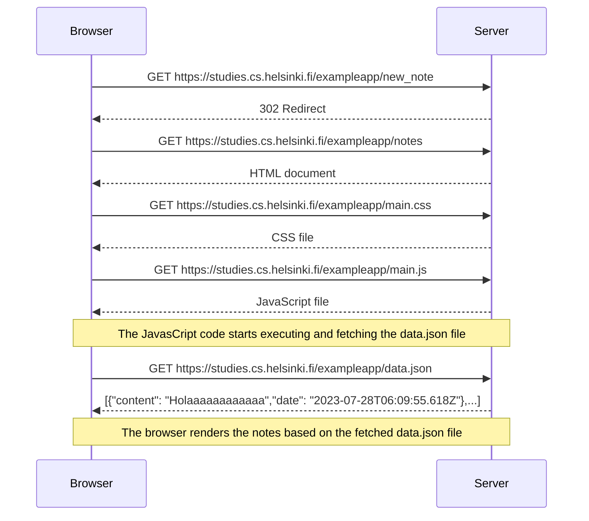

```mermaid
sequenceDiagram
    Browser->>Server: GET https://studies.cs.helsinki.fi/exampleapp/new_note
    Server-->>Browser: 302 Redirect
    Browser->>Server: GET https://studies.cs.helsinki.fi/exampleapp/notes
    Server-->>Browser: HTML document
    Browser->>Server: GET https://studies.cs.helsinki.fi/exampleapp/main.css
    Server-->>Browser: CSS file
    Browser->>Server: GET https://studies.cs.helsinki.fi/exampleapp/main.js
    Server-->>Browser: JavaScript file
    Note over Browser,Server: The JavasCript code starts executing and fetching the data.json file
    Browser->>Server: GET https://studies.cs.helsinki.fi/exampleapp/data.json
    Server-->>Browser: [{"content": "Holaaaaaaaaaaaa","date": "2023-07-28T06:09:55.618Z"},...]
    Note over Browser,Server: The browser renders the notes based on the fetched data.json file 
```