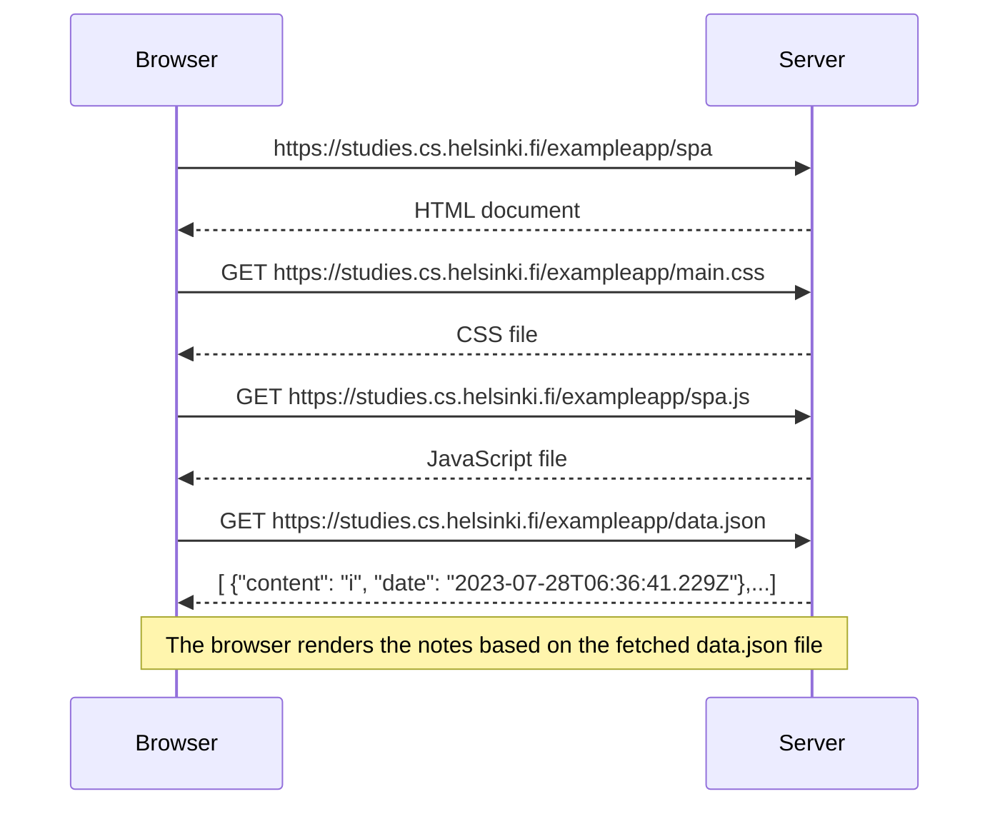

```mermaid
sequenceDiagram
    Browser->>Server: https://studies.cs.helsinki.fi/exampleapp/spa
    Server-->>Browser: HTML document
    Browser->>Server: GET https://studies.cs.helsinki.fi/exampleapp/main.css
    Server-->>Browser: CSS file
    Browser->>Server: GET https://studies.cs.helsinki.fi/exampleapp/spa.js
    Server-->>Browser: JavaScript file
    Browser->>Server: GET https://studies.cs.helsinki.fi/exampleapp/data.json
    Server-->>Browser: [ {"content": "i", "date": "2023-07-28T06:36:41.229Z"},...]
    Note over Browser,Server: The browser renders the notes based on the fetched data.json file
```